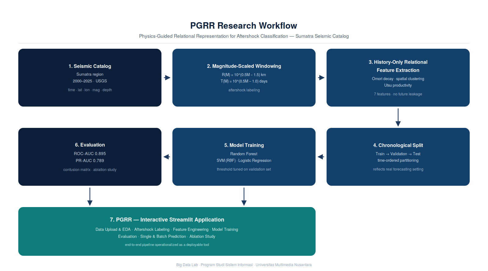

# AI-Based Regional Aftershock Prediction Based on Physics-Guided Relational Representation

Official implementation of **"AI-Based Regional Aftershock Prediction Based on Physics-Guided Relational Representation"** — includes the interactive Streamlit application **PGRR**.

📄 **Paper**: [-] 
---

## 📋 Overview

Aftershock sequences following major earthquakes pose significant risk to affected regions, yet distinguishing genuine aftershocks from background seismicity remains challenging with purely statistical approaches. This project introduces **PGRR (Physics-Guided Relational Representation)**, a feature engineering framework that encodes established seismological physics — Omori-law temporal decay, spatial clustering, and Utsu-law productivity — directly into machine learning features, while strictly preventing temporal leakage through history-only relational computation.

- **Objective**: Classify aftershock events in the Sumatra seismic catalog using physics-informed, leakage-free features and interpretable ML models.
- **Dataset**: Sumatra earthquake catalog, USGS (2000–2025).
- **Methods**: Magnitude-scaled spatiotemporal windowing, history-only relational feature extraction, chronological train/validation/test splitting, evaluated with Random Forest, SVM (RBF), and Logistic Regression.
- **Contribution**: A reproducible, physics-guided pipeline (and accompanying interactive app, PGRR) for regional aftershock discrimination that can be extended to other seismic regions.

### Key Features

- **Magnitude-Scaled Windowing**: Spatial and temporal windows scale with event magnitude — R(M) = 10^(0.5M − 1.5) km, T(M) = 10^(0.5M − 1.0) days (with configurable cap) — following empirical rupture-scaling relations.
- **History-Only Relational Features**: All 7 engineered features are computed strictly from past events relative to each candidate, preventing temporal/data leakage across train, validation, and test splits.
- **Physics-Guided Feature Set**: Omori-like temporal decay, spatial clustering (Haversine distance), and Utsu-like productivity proxies — 7 features total (see [Results](#-results)).
- **Chronological Splitting**: Train/validation/test partitions preserve time order, reflecting realistic forecasting conditions rather than random shuffling.
- **Multi-Model Benchmarking**: Random Forest, SVM (RBF kernel), and Logistic Regression trained and compared under identical feature/evaluation conditions, with threshold optimization on the validation set.
- **Interactive Application (PGRR)**: End-to-end Streamlit app covering data upload/EDA, labeling, feature engineering, training, evaluation, single/batch prediction, and ablation study.

---

## 🎯 Key Contributions

1. **Physics-Guided Relational Representation (PGRR)**: A feature framework that embeds Omori-law decay, spatial clustering, and Utsu-law productivity into ML-ready, leakage-free features.
2. **Leakage-Safe Evaluation Protocol**: History-only feature computation combined with chronological splitting, addressing a common methodological flaw (temporal leakage) in aftershock classification studies.
3. **Interpretable Model Comparison**: Systematic benchmarking of Random Forest, SVM, and Logistic Regression on the same physics-guided feature set, including ablation analysis of feature-group contributions.
4. **PGRR Application**: A deployable, interactive tool that operationalizes the PGRR pipeline for practical regional aftershock screening.

---

## Project Architecture / Research Workflow

<p align="center">
  
</p>

*(Diagram: Sumatra Seismic Catalog → Magnitude-Scaled Windowing → History-Only Relational Feature Extraction → Chronological Train/Val/Test Split → Model Training (RF / SVM / LogReg) → Evaluation (ROC-AUC, PR-AUC) → Prediction Interface)*

> Diagram file to be generated and placed at `framework.png` — see note below.

---

## 🚀 Installation

### Requirements

- Python 3.9+
- streamlit >= 1.30.0
- pandas >= 2.0.0
- numpy >= 1.24.0
- scikit-learn >= 1.3.0
- plotly >= 5.18.0
- matplotlib >= 3.7.0
- seaborn >= 0.12.0
- openpyxl >= 3.1.0

### Setup

1. Clone the repository:
```bash
git clone https://github.com/Big-Data-Laboratory-UMN/Benedictus Arya Pradipta_00000079179_PGRR.git
cd PGRR-Aftershock-Classification-Sumatra
```

2. Create a virtual environment:
```bash
conda create -n pgrr python=3.9
conda activate pgrr
```

3. Install dependencies:
```bash
pip install -r requirements.txt
```

4. Run the application:
```bash
streamlit run app.py
```
Then open `http://localhost:8501`.

---

## 📊 Dataset Preparation

### Sumatra Seismic Catalog (2000–2025)

- **Source**: United States Geological Survey (USGS) Earthquake Catalog.
- **Coverage**: Sumatra region (bounding box: lat −7.5° to 7.5°, lon 92.0° to 107.0°), 2000–2025.
- **Format**: CSV, columns include `time`, `latitude`, `longitude`, `mag`, `depth` (optional), `id` (optional).
- **Note**: This is a public catalog dataset (secondary source). Preprocessing specific to this study — Sumatra bounding-box filtering, magnitude-scaled labeling, and physics-guided feature derivation — was performed as part of this research pipeline. *(Confirm with supervisor whether additional justification is required given the lab's primary-data guideline.)*

### Download

Once downloaded, place the CSV as follows:
```
PGRR/
├── data/
│   └── data_gempa_sumatera.csv
```

---

## 🏋️ Training

Training is performed interactively through the PGRR Streamlit interface (Page 4: Model Training), or can be scripted directly using `core/models.py`.

- **Models**: Random Forest, SVM (RBF kernel), Logistic Regression
- **Split**: Chronological train / validation / test
- **Threshold**: Optimized per-model on the validation set
- **Execution** (via app):
```bash
streamlit run app.py
# → Page 1: Data Upload & EDA
# → Page 2: Aftershock Labeling
# → Page 3: Feature Engineering
# → Page 4: Model Training
```

---

## 📊 Results

| Metric | Value |
|--------|-------|
| ROC-AUC | 0.895 |
| PR-AUC | 0.789 |

### Physics-Guided Features (7)

| Feature | Physics Principle | Description |
|---------|--------------------|--------------|
| `mag` | Direct | Event magnitude |
| `log_dt_big_near` | Omori-like | Log time since nearest large event |
| `log_dr_big_near` | Spatial decay | Log distance to nearest large event |
| `log_n_prev_30d` | Utsu productivity | Log count of events in prior 30 days |
| `log_n_prev_30d_r50` | Local clustering | Log count of events within 50 km, prior 30 days |
| `log_n_big_prev_30d` | Productivity | Log count of large events in prior 30 days |
| `max_mag_prev_7d` | Short-term | Maximum magnitude in prior 7 days |

Full evaluation results (ROC/PR curves, confusion matrices, bootstrap confidence intervals, feature importance, and ablation study) are available in the PGRR app (Pages 5 and 7) and in the accompanying thesis/paper.

---

## 🏗️ Project Structure

```
PGRR/
├── app.py                     # Main Streamlit application (PGRR)
├── requirements.txt           # Python dependencies
├── README.md                  # This file
├── .streamlit/
│   └── config.toml
├── core/
│   ├── __init__.py
│   ├── physics.py             # Haversine distance, labeling, feature engineering
│   └── models.py              # RF, SVM, LR pipelines & evaluation
└── data/
    └── data_gempa_sumatera.csv
```

---

## 📝 Citation

If you find this work useful for your research, please cite:

```bibtex
@inproceedings{pradipta2026pgrr,
  title={AI-Based Regional Aftershock Prediction Based on Physics-Guided Relational Representation},
  author={Pradipta, Benedictus Arya and Johan, Monika Evelin},
  booktitle={IEEE ICOEINS 2026},
  year={2026}
}
```

---

## 🙏 Acknowledgments

- Big Data Lab, Information Systems Study Program, Universitas Multimedia Nusantara (UMN).
- Supervisor: Monika Evelin Johan.
- Dataset provider: United States Geological Survey (USGS).

---

## 📧 Contact

For questions or issues, please:
- Open an issue on GitHub
- Contact: benedictus.arya@student.umn.ac.id

---

## 📜 License

Research use only. Developed for the Sumatra aftershock prediction study, Universitas Multimedia Nusantara.
